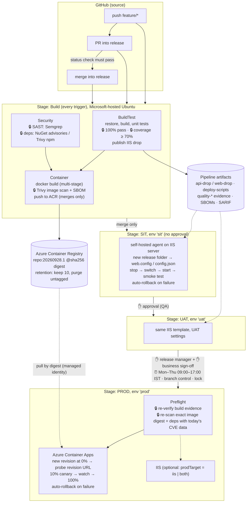

# CI/CD pipeline: Angular.web + NetCore.API on Azure DevOps

Two repositories, one delivery system:

| Repo | App | Pipeline |
|---|---|---|
| [`NetCore.API`](https://github.com/rohityadav10/NetCore.API) | .NET 8 Web API | `.azure/azure-pipelines.yml` |
| [`Angular.web`](https://github.com/rohityadav10/Angular.web) | Angular 21 SPA | `.azure/azure-pipelines.yml` |

This document is identical in both repositories. The one-time portal setup is in
[`.azure/SETUP.md`](.azure/SETUP.md). The earlier GitHub Actions workflows in `.github/`
are untouched and keep running; the Azure DevOps pipeline lives entirely under `.azure/` (see §10).

---

## 1. Tool selection

**Azure DevOps Pipelines, with the code staying in GitHub.** The deciding requirements were the
approval workflow and the on-premises target:

- **Environments with approvals and checks.** Approvals, a *second* sign-off, business hours,
  branch control and exclusive locks are built-in checks on an environment, configured once and
  enforced for every pipeline that deploys there. GitHub offers required reviewers and wait
  timers, but has no native business-hours check.
- **On-premises IIS.** Self-hosted agent pools are first-class, and pipeline artifacts flow to them
  without extra plumbing.
- **Workload identity federation.** Azure Resource Manager service connections are OIDC-based:
  no client secret exists anywhere.
- **Variable groups**, optionally backed by Key Vault, hold per-environment secrets with
  per-pipeline authorisation.

The cost: YAML templates are compiled at queue time, and the approval/check configuration lives in
the portal, not in the repo. `.azure/SETUP.md` records it step by step.

| Concern | Choice | Why |
|---|---|---|
| Container registry | **Azure Container Registry** (Basic) | Same cloud as Container Apps; pulls by managed identity (no passwords); retention by the pipeline (keep 10 + anything a live revision runs; ACR Tasks are blocked on trial subscriptions); Defender for Containers for registry-side scanning. |
| Artifact repository | **Pipeline artifacts** | Both apps are deployable applications, not libraries, so no NuGet/npm packages are produced. The IIS drops are pipeline artifacts tied to the exact run. Azure Artifacts would become relevant for shared libraries or as an upstream proxy (§9). |
| SAST | **Semgrep** (pinned container, public rulesets) | One tool for C#, TypeScript, Dockerfiles, secrets and CI YAML. Free, fast, no server. SonarCloud is wired in as an optional extra (`enableSonarCloud`). |
| Dependency scan | **NuGet advisories** (`dotnet list package --vulnerable`) for .NET; **Trivy** for npm | Trivy can't see a .NET dependency graph from source (it needs a lock file or `*.deps.json`). The SDK's own check covers transitive and test packages against the GitHub Advisory Database. For npm, Trivy reads `package-lock.json` directly. |
| Image scan + SBOM | **Trivy** (pinned by digest) | Same tool as the npm gate; also emits CycloneDX SBOMs. |
| IaC | **Bicep** | Native to Azure, no state file to manage. |

## 2. Branching strategy

**GitHub Flow**: short-lived `feature/*` branches, PRs into one integration branch. In these repos
that branch is **`release`** (the default branch, the exercise's "Main"). `main` is also accepted
by the triggers, so a rename needs no pipeline change.

| Event | What runs |
|---|---|
| Push to `feature/*` | Build stage only: compile, test, coverage, SAST, dependency scan, image build and scan. No push, no deploy. |
| PR into `release` | Same Build stage, reported as a GitHub status check; branch protection blocks the merge until it's green. |
| Merge into `release` | Build → push image → **SIT** (auto) → **UAT** (approval) → **PROD** (approvals + checks). |

Why not GitFlow or environment branches? **Environments are promotion stages, not branches.** One
commit is built once and the same bytes move SIT → UAT → PROD. With a branch per environment, a
different build goes to each environment, and merges between those branches are where drift and
hotfix mistakes creep in. The old `sit`/`uat` branches are used only by the GitHub Actions
workflows.

## 3. Pipeline architecture

🔒 = gate that stops the pipeline. ✋ = manual approval (environment check).
The same diagram as an image, for viewers that don't render Mermaid: [`.azure/pipeline-architecture.png`](.azure/pipeline-architecture.png).

| Stage | Jobs | Runs on | Output |
|---|---|---|---|
| Build | `BuildTest` ∥ `Security` → `Container` → `Notify` | Microsoft-hosted `ubuntu-24.04` | IIS drop, image in ACR (merges only), test/coverage/scan reports, `quality-*` evidence, SBOMs |
| SIT | `DeployIIS` (deployment job, env `sit`) | `OnPrem-IIS` agent on the IIS server | site `ado-<app>-sit` |
| UAT | `DeployIIS` (env `uat`) | `OnPrem-IIS` | site `ado-<app>-uat` |
| PROD | `Preflight` → `DeployContainerApps` [+ `DeployIIS`] (env `prod`) | hosted Ubuntu [+ `OnPrem-IIS`] | new Container Apps revision at 100% |

**Templates** (the exercise's `deploy-sit/uat/prod.yml` become reusable templates rather than three
near-copies):

| Exercise deliverable | Where it lives |
|---|---|
| `pipelines/build.yml` | `.azure/azure-pipelines.yml` (triggers, stage order) + `.azure/templates/stages/build.yml` |
| `deploy-sit.yml` / `deploy-uat.yml` | `SIT` / `UAT` stages → `.azure/templates/jobs/deploy-iis.yml`, values from `templates/variables/sit.yml` / `uat.yml` |
| `deploy-prod.yml` | `PROD` stage → `templates/jobs/prod-preflight.yml` + `templates/jobs/deploy-containerapps.yml` |
| `Dockerfile.api` / `Dockerfile.frontend` | `.azure/docker/` in each repo |
| `docker-compose.yml` | repo root (existing) |
| `scripts/deploy-iis.ps1`, `rollback-iis.ps1`, `health-check.ps1`, `deploy-containerapps.sh` | `.azure/scripts/` |
| `sonar-project.properties` | repo root (existing); SonarCloud steps are behind `enableSonarCloud` |
| `.github/dependabot.yml` | existing, now also covering the `.azure/docker` base images |
| IaC (bonus) | `NetCore.API/.azure/infra/main.bicep` (provisions the PROD side of both apps) |
| Manual rollback | `.azure/rollback.yml` |

## 4. Environment configuration

Nothing environment-specific is compiled into an artifact. Values come from four layers:

| Layer | Holds | Where |
|---|---|---|
| `templates/variables/common.yml` | registry, resource group, tool image digests, coverage threshold | repo (identical in both) |
| `templates/variables/<env>.yml` | non-secret per-environment values: IIS site names/ports, ASPNETCORE_ENVIRONMENT, canary settings | repo (identical in both) |
| Variable group `devops-exercise-<env>` | secrets, e.g. `ConnectionStrings__Default` | Azure DevOps Library (optionally Key Vault-linked), authorised per pipeline |
| Environment `sit` / `uat` / `prod` | approvals and checks | Azure DevOps |

How the values reach each app:

- **API on IIS.** `deploy-iis.ps1` writes them into the release folder's `web.config` as
  `<aspNetCore><environmentVariables>`: `ASPNETCORE_ENVIRONMENT`, `Cors__AllowedOrigins__0` (the
  SPA's URL), and secrets. Secrets travel as process environment variables mapped from the
  variable group, never on a command line or in a log.
- **API on Container Apps.** Plain values become env vars. Secrets become Container App
  **secrets**, referenced as `secretref:`. The SPA's URL is resolved at deploy time from the
  `angular-web` app's FQDN (`{{fqdn:angular-web}}`), so no URL is typed in by hand.
- **SPA.** An Angular bundle normally bakes its environment in at build time, which breaks
  "build once". Here the browser fetches **`/config.json`** at startup (`environment`,
  `apiBaseUrl`, `version`). The IIS deploy writes that file into the release folder; the container
  writes it at start from `APP_ENVIRONMENT` / `API_BASE_URL`. `version` is the build number.

## 5. Security and quality gates

Every gate fails its stage; later stages don't run. Each writes a `summary-*.json` into a
`quality-*` artifact, which the PROD preflight re-reads.

| Gate | Tool | Where | Fails on | Why there |
|---|---|---|---|---|
| Unit tests | xUnit (TRX) / Jasmine+Karma (JUnit) | Build › BuildTest | any failure, or zero tests | Cheapest signal first. Results go to the *Tests* tab. |
| Code coverage | Coverlet / Karma (Cobertura) | Build › BuildTest | line coverage < **70%** | Next to the tests that produce it. HTML report on the *Code Coverage* tab. API is at 98%, web at 96%, so no threshold was lowered. |
| SAST | Semgrep: `p/csharp` or `p/typescript`+`p/javascript`, `p/secrets`, `p/owasp-top-ten`, `p/dockerfile` | Build › Security (parallel with BuildTest) | any ERROR / HIGH / CRITICAL | Needs source only, so it runs in parallel. SARIF in `CodeAnalysisLogs`. |
| Dependencies | NuGet advisories (.NET, incl. transitive and test projects); Trivy on `package-lock.json` incl. devDependencies (npm) | Build › Security | any High/Critical with a fix available | Before anything is packaged. Build tooling is supply chain too. |
| Container image | Trivy + CycloneDX SBOM | Build › Container, **before push** | any fixable HIGH/CRITICAL | A vulnerable image never reaches the registry. |
| PROD preflight | evidence re-check + Trivy re-scan of the **image digest** + fresh dependency check | PROD › Preflight, after approvals | missing/failed evidence, coverage below the *current* threshold, or any new High/Critical | Approval can come days after the build; CVEs published meanwhile must still block. |

Policy details:

- **"Fixable" High/Critical block; unfixed ones are reported.** A finding with no patched version
  can't be fixed by the team; it's surfaced as a warning and in the report. Accepted risks go in
  `.azure/.trivyignore.yaml`, each with a reason, an approver and an **expiry date**. After that
  date the gate fails again.
- **Pinned tooling.** Trivy and Semgrep run as containers pinned by **version and digest**. A moved
  tag can't change what executes. (Floating tags such as `trivy-action@master` are what
  supply-chain attacks on CI tools exploit.)

## 6. Deployment strategy

**Images: build once, promote by digest.** Tag = build number (`netcore-api:20260928.1`). The
Build stage records the image's **digest**; every later stage deploys `…@sha256:<digest>`, the
exact bytes that were scanned. The environment isn't part of the tag: *where* a build runs is
tracked by the environment's deployment history in Azure DevOps. A `-sit`/`-uat` tag per
environment would imply different images, which is what "build once" avoids.

**PROD target: Azure Container Apps.** SIT and UAT mirror the on-premises estate (IIS). PROD goes
to Container Apps for autoscaling (1–10 replicas on HTTP concurrency), managed TLS, zone-level
resilience, and **revision-based releases**, which make canary deployment and instant rollback
cheap. `prodTarget = iis | both` reuses the IIS template for organisations that must stay on-prem.

**IIS (SIT/UAT), `deploy-iis.ps1`.** It uses side-by-side release folders
(`C:\inetpub\ado\<site>\releases\<build>`):

1. Copy the artifact to a **new** folder, so the live site is untouched while copying.
2. Write that environment's `web.config` settings, or `config.json` plus a `web.config` with SPA
   fallback, no-cache and security headers.
3. Create the app pool (No Managed Code) and site on first deployment; otherwise remember the live
   folder as the rollback target.
4. Stop the app pool and site, **point the site at the new folder**, and start them.
5. Smoke test: liveness (`/health` or `/`), then **version**. `/api/AppStatus` or `/config.json`
   must report this build number, which proves the new build is serving and not a stale copy.
6. Any failure switches back to the previous folder and fails the deployment.

   The agent runs on the IIS server. A WinRM "jump-box" mode (`targetServer`) runs the same steps
   remotely.

**Container Apps (PROD), `deploy-containerapps.sh`.** Canary:

1. Pin 100% of traffic to the stable revision **by name**.
2. Create the new revision (0% traffic) from the image digest with this environment's
   settings. Wait until it's provisioned and healthy.
3. Probe the **revision's own URL**: health and version, while users see none of it.
4. Send **10%** of traffic to it and watch both the revision and the public URL for 120 s.
5. Promote to 100%. The previous revision stays active at 0% as the instant rollback target;
   older ones are deactivated.

## 7. Rollback strategy

| | Automatic | Manual (`.azure/rollback.yml`, gated by the same environment approvals) |
|---|---|---|
| **IIS** | A failed smoke test switches the site back to the previous release folder and restarts it. The failed folder is kept as `*.failed` for diagnosis. | `rollback-iis.ps1` points the site at `previous` or a named build folder (the last 5 are kept), then smoke tests it. |
| **Container Apps** | Any failure after the new revision exists returns 100% of traffic to the stable revision and deactivates the new one. | Shift 100% of traffic to the previous revision (kept active) or to a named build's revision, reactivating it if needed. No image rebuild is involved. |

Every deploy and rollback on IIS is appended to `C:\inetpub\ado\<site>\deployments.log`.

## 8. Assumptions

- **IIS server**: `rohit-vm` (the same server the GitHub runner uses), Windows Server with IIS,
  the ASP.NET Core 8 Hosting Bundle and URL Rewrite. The ADO-deployed sites use their own names
  and ports (`ado-*`, 8180/8181, 8280/8281), so both pipelines can run side by side.
- **SIT and UAT share one IIS server**, with separate sites and app pools. In a real estate they'd
  be separate servers; the templates already take the agent pool / target server as parameters.
- **Database**: the sample API has no database or EF Core context yet. The connection string is
  wired end to end as a secret (variable group → web.config / Container App secret), but nothing
  reads it. An EF Core migration step is listed in §9.
- **Tooling**: free tiers throughout. The Azure DevOps hosted-agent grant must be requested for a
  new organisation (SETUP step 1).
- **Business hours** use India Standard Time (UTC+05:30), Mon–Thu 09:00–17:00.
- **The API is deployed before the SPA** in each environment. Otherwise the SPA's badge reads
  "API: unreachable" until it is (the SPA still deploys and passes its own checks).

## 9. Improvements with more time

- **EF Core migrations as a gated step**: build an idempotent `dotnet ef migrations bundle` in the
  Build stage, and run it per environment before the app switch, with a backup/restore point in PROD.
- **Metric-driven canary**: promote based on Container Apps HTTP 5xx rate and latency from Log
  Analytics, instead of synthetic probes only.
- **Health probes in Bicep** (liveness `/health`) once real images replace the placeholder, and
  `az deployment` of the Bicep from a pipeline with a *what-if* gate.
- **Cross-repo templates**: move the identical templates and scripts into a shared template
  repository referenced through `resources.repositories`, pinned by tag.
- **Key Vault** for all secrets, read at runtime by the apps through managed identity, so no
  secret sits in `web.config` on disk.
- **Separate IIS servers** for SIT and UAT, and blue-green on IIS (two sites behind ARR) for
  zero-downtime switches.
- **Azure Artifacts** as the upstream proxy for npm and NuGet, so builds don't depend on public
  registries being up.
- **Signed images** (Notation) plus a Container Apps admission check.
- **Retire the GitHub Actions path** once this pipeline is adopted, and fix its remaining known
  findings (§10).

## 10. Changes outside `.azure/`, and known findings

Adding real gates exposed problems the GitHub pipeline had been passing over. They were fixed at
the source, not suppressed:

| Change | Why |
|---|---|
| **Angular 19 → 21.2** (`ng update` migrations) | Angular 19 is out of support and had **5 High runtime CVEs** (XSS, SSRF, sanitisation bypass) with no 19.x fix. The GitHub pipeline didn't catch them because its Angular Trivy steps use `exit-code: '0'`. 21.2 is patched, in LTS, and still runs on the Node 20 the GitHub workflow pins (22.x needs Node ≥ 22.22). |
| `Mvc.Testing` 8.0.8 → 8.0.31 | It pulled in `System.Text.Json` 8.0.4 (High, GHSA-8g4q-xg66-9fp4). |
| API: `/health`, build-stamped version in `/api/AppStatus`, config-driven CORS | Probe target for IIS and Container Apps; version-asserting smoke tests; the SPA can call the API per environment. Unset config = previous behaviour. |
| SPA: runtime `config.json` instead of hard-coded `environment = 'SIT'` | Required for build-once-promote and "never hard-coded". |
| `.github/workflows/rollback.yml`: input passed via an env var | **Command injection**: `${{ github.event.inputs.backup_dir }}` was interpolated into PowerShell on the self-hosted runner (Semgrep `run-shell-injection`, ERROR). Same behaviour for legitimate input. |
| `karma.conf.ci.js`: `lcovonly` reporter; Dependabot: `docker` ecosystem | SonarCloud input; keeps the new base images patched. |

Known finding, deliberately **not** fixed because it belongs to the GitHub path: the **root
`Angular.web/Dockerfile` runs nginx as root** (Semgrep `missing-user`, ERROR). Fixing it means
moving off port 80, which would change what the GitHub workflows and `docker-compose.yml` produce.
The Azure DevOps SAST gate therefore excludes that one file. The image this pipeline ships
(`.azure/docker/Dockerfile.frontend`) runs as uid 101 and **is** scanned. Also reported, as
warnings: the GitHub workflows use mutable action tags (`@v4`, `@master`) rather than commit SHAs.

Verified locally before the first pipeline run:

- both apps build;
- API 13/13 tests at 98% coverage; web 12/12 at 96%;
- the SPA fetches `config.json` and calls the API across origins in headless Chrome;
- every PowerShell script parses; the `web.config` transform and the smoke test ran against a
  real publish output;
- the gates pass on this code, and fail on a planted vulnerable package, the old Angular 19
  lockfile, a raised coverage bar and missing evidence;
- the Bicep compiles and lints clean;
- the Container Apps traffic queries were checked against JMESPath.

Not run locally: the Docker builds (no Docker on the authoring machine) and anything that needs
the Azure DevOps service, IIS or Azure. The first pipeline run is the check for those.

## 11. AI assistance

This pipeline was built with Claude (Anthropic) as a pair-programmer. It read the existing
repositories and the exercise brief, then drafted the YAML templates, scripts, Bicep and this
document. It also ran the local verification listed in §10: the builds and tests, the Semgrep and
Trivy scans that surfaced the Angular CVEs and the workflow injection, and the script tests. The
submitter reviewed the design, the trade-offs and every change before submission.
